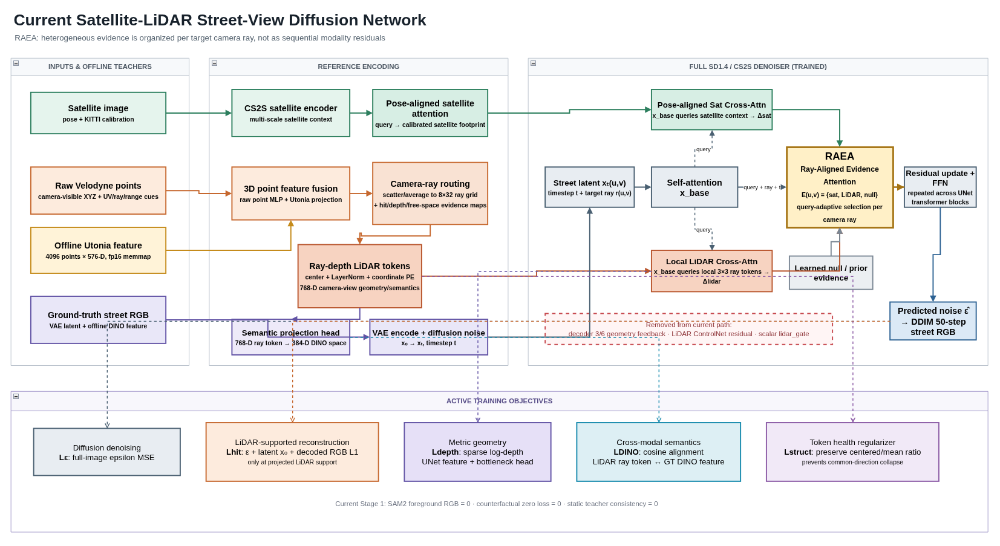
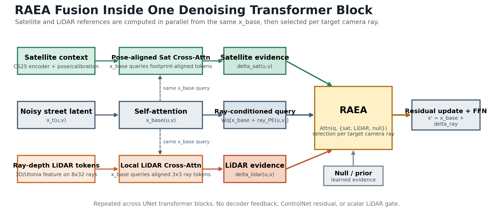
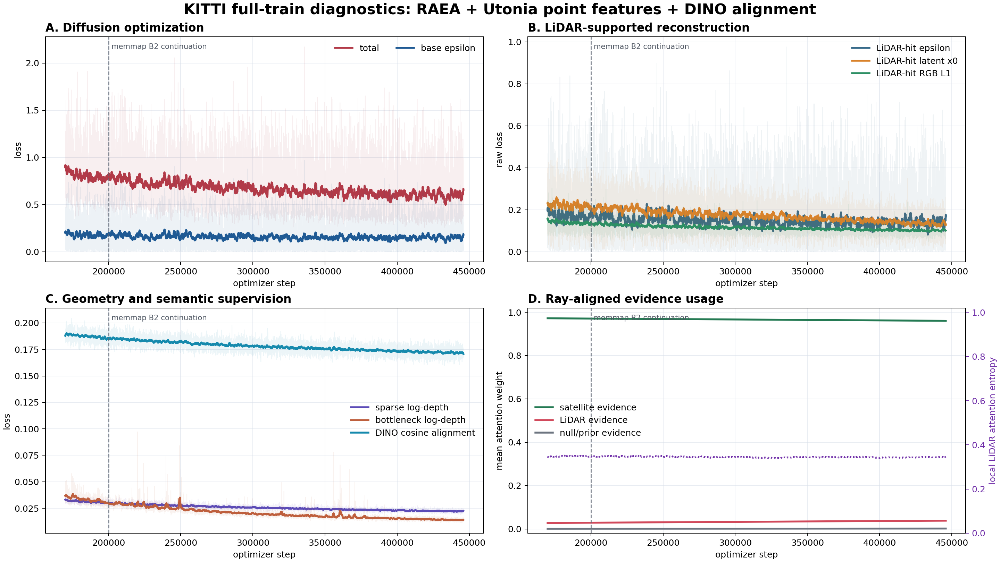
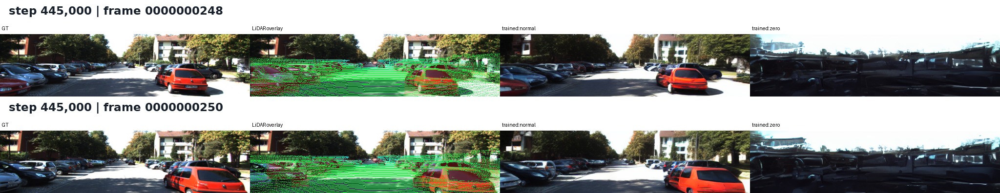

# 组会 PPT 提纲：Satellite + LiDAR 街景生成

## Slide 1｜问题与目标

**标题：从卫星全局先验到实时 LiDAR 几何约束**

- CS2S 已能生成自然 KITTI 街景，但车辆主要来自数据先验。
- 目标：让车辆位置/尺度更符合实时 LiDAR，同时保留卫星图的道路与静态布局能力。
- 核心问题：LiDAR 如何进入 denoising 的结构决策，而不是只做轻量 residual correction。

讲法：原模型不是不会生成车，而是生成得太像“训练集里通常会出现的车”；我们要让它参考当前帧真实几何。

## Slide 2｜方法演进

**标题：从条件插件转向 ray-aligned evidence**

```text
早期：sparse depth / ControlNet residual
中期：sat-attn -> lidar-attn 串行 cross-attention
当前：sat_ref + lidar_ref + null -> RAEA per camera ray
```

- residual branch：影响太弱，旧 CS2S prior 容易忽略。
- decoder feedback：影响很强，但会污染全局亮度和风格。
- 当前版本：删除旁路，用 denoiser 主 transformer 内的 RAEA 完成融合。

## Slide 3｜当前网络结构



重点讲三句话：

1. CS2S 的 pose-aligned satellite sampling 被完整保留。
2. raw LiDAR + Utonia per-point feature 被路由到 `8 x 32` camera-ray token grid。
3. satellite、LiDAR、null 从同一个 `x_base` 并行生成 evidence，再由 RAEA 按 ray 选择。

RAEA 细节图：



## Slide 4｜LiDAR 表征与监督

**标题：3D 语义先验 + camera-ray 几何对齐**

- 4096 个 camera-visible point，每点 576-D Utonia feature。
- raw XYZ/UV/range cue 与 Utonia feature 融合。
- local `3 x 3` reference attention 保留图像空间对应。
- DINO 只作为 GT image teacher，不作为推理条件。

当前 loss：

```text
L_eps
+ LiDAR-hit eps/x0/RGB
+ sparse log-depth
+ DINO cosine alignment
+ token structure regularization
```

## Slide 5｜训练规模与工程优化

- Full train：17,055 帧，batch 2。
- 当前日志：170k -> 445.86k，约 32.35 个 epoch 等价曝光。
- DDIM 50-step，每 5k step 固定测试帧。
- Utonia/DINO 改为 fp16 memmap：1.80 -> 1.98 samples/s，约 +10.5%。
- 峰值显存约 19.94 GB。

## Slide 6｜训练曲线



讲数字：

- total loss：-28.1%
- LiDAR-hit RGB L1：-28.9%
- sparse depth：-30.8%
- bottleneck depth：-60.8%
- DINO alignment：-9.0%
- LiDAR evidence weight：+37.6%

解释：几何、图像支持区和语义三条链同时变好，不是只有一个辅助头在独自学习。

## Slide 7｜50-step DDIM 效果



列：`GT | LiDAR overlay | normal | zero`。

- normal 在近场车辆位置能形成稳定车辆结构。
- 相邻帧的车辆位置与尺度发生对应变化。
- zero 严重退化，证明 LiDAR 已成为关键条件。
- 但 zero 是 out-of-distribution probe，不等于原始 CS2S baseline。

## Slide 8｜阶段结论与下一步

**阶段结论**

- LiDAR 不是“起不来”；当前主链路已经学会读取并使用 LiDAR。
- reference-only RAEA 可以替代 decoder geometry feedback 的控制作用。
- 当前瓶颈转为静态外观质量和 satellite-only fallback。

**下一步**

1. 同 seed、同测试集对比原始 `KITTI.ckpt`、RAEA normal、RAEA zero。
2. 扩展 held-out drive，增加车辆中心/尺度/overlap 与背景 LPIPS 指标。
3. Stage 2 appearance recovery：保留 depth/DINO，加入非冲突区域 CS2S teacher consistency，小 LR 修复静态街景。
4. 从 `step_440000.pt` 恢复前，定位 445860 的外部中止原因。
