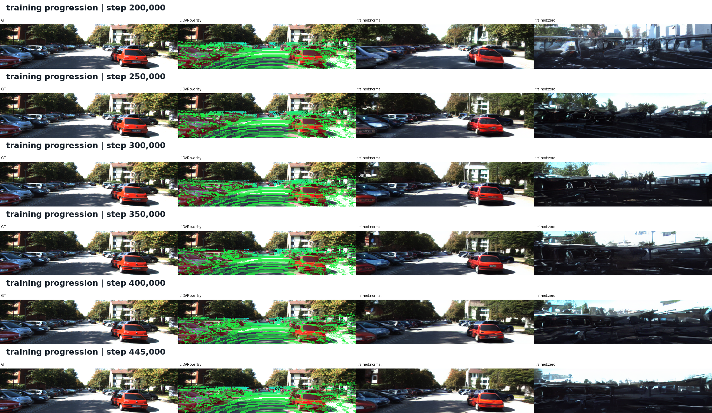

# Satellite + LiDAR 街景生成阶段性汇报

日期：2026-07-17

## 一句话结论

当前方法已经证明：**预训练 3D 点特征经过 camera-ray routing 和 RAEA 后，可以稳定进入 CS2S/SD1.4 的 denoising 决策，并改善 LiDAR 支持区域的几何重建。** 但现阶段还不能宣称整体生成质量优于原始 CS2S；主要未解决问题是静态街景自然度和无 LiDAR 时的回退能力。

## 1. 研究目标

原始 CS2S 使用 pose-aligned satellite reference 约束道路方向和静态布局，但动态车辆主要依赖 KITTI 街景先验，容易生成与实时场景不一致的车辆位置、数量和尺度。

本阶段目标不是让 LiDAR 取代卫星图，而是让两种条件分工：

- Satellite：提供跨视角的全局布局和静态场景先验。
- LiDAR：提供目标相机视角下的实时度量几何与物体证据。
- Denoiser：按每条目标 camera ray 自适应选择 satellite、LiDAR 或 prior evidence。

## 2. 当前网络设计


可编辑源文件：[current_network.drawio](assets/current_network.drawio)

### 2.1 Satellite reference

沿用 CS2S 最有价值的部分：

```text
satellite image
-> CS2S satellite encoder
-> pose-aligned satellite attention
-> satellite evidence per street-view query
```

这里不是普通全局 cross-attention。网络根据 KITTI 内参、相机位姿和平移/旋转参数，把 street latent query 对齐到 satellite feature map 的对应 footprint。

### 2.2 LiDAR reference

当前 LiDAR 条件不是简单的 sparse depth image：

```text
raw camera-visible Velodyne points
+ offline Utonia per-point feature (4096 x 576-D)
-> raw point MLP + Utonia projection
-> projected camera-ray scatter/average
-> 8 x 32 ray token grid
-> hit/depth/free-space evidence maps
-> center + LayerNorm + coordinate position encoding
-> 768-D ray-depth LiDAR tokens
```

每个 latent query 只从对应 ray 的局部 `3 x 3` LiDAR token 邻域读取 reference，保留前视空间对应关系，避免把整帧点云压成一个全局向量。

### 2.3 RAEA fusion


可编辑源文件：[raea_fusion_detail.drawio](assets/raea_fusion_detail.drawio)

每个 UNet transformer block 内部的数据流为：

```text
x_base = self_attention(x_t) + x_t

sat_ref   = pose_aligned_sat_attention(x_base, satellite_tokens)
lidar_ref = local_ray_reference_attention(x_base, lidar_tokens)

E(u,v) = {sat_ref, lidar_ref, null/prior}
delta  = RAEA(query=x_base+ray_PE(u,v), evidence=E(u,v))

x = x_base + delta
x = FFN(x) + x
```

扩散 timestep 不作为 RAEA 的独立输入；它已经通过上游 UNet residual blocks 编码在 `x_base` 中。RAEA 这里只额外加入目标二维 camera-ray position encoding。

关键变化是：satellite 与 LiDAR 从同一个 `x_base` 并行产生 reference，再按目标 camera ray 统一融合；不再是 `sat residual -> lidar residual` 的插件式串行结构。

当前主路径已经删除：

- decoder 3/6 geometry feedback；
- LiDAR ControlNet residual branch；
- 旧 scalar `lidar_gate`。

## 3. 当前训练损失

当前 Stage 1 的总目标为：

```text
L = L_eps
  + 1.0 * L_hit_eps
  + 0.5 * L_hit_x0
  + 2.0 * L_hit_rgb
  + 1.0 * L_depth_unet
  + 1.0 * L_depth_bottleneck
  + 0.2 * L_DINO
  + 0.01 * L_token_structure
```

各损失的职责：

| Loss | 监督对象 | 作用 |
|---|---|---|
| `L_eps` | 全图扩散噪声 | 保持 SD/CS2S 的基本生成能力 |
| `L_hit_eps` | LiDAR 投影支持区域 | 提高几何证据区域在 denoising 中的权重 |
| `L_hit_x0` | LiDAR 支持区域的 latent `x0` | 约束中间重建，不只约束最终 RGB |
| `L_hit_rgb` | LiDAR 支持区域的 decoded RGB | 让几何证据最终影响可见生成结果 |
| `L_depth_*` | LiDAR hit 位置的 log-depth | 提供 satellite/先验无法替代的度量几何任务 |
| `L_DINO` | LiDAR ray token 与 GT DINO feature | 把预训练 3D 特征对齐到图像高级语义空间 |
| `L_token_structure` | LiDAR token 分布 | 防止 token 重新塌缩到公共方向 |

当前未启用：SAM2 foreground RGB loss、zero counterfactual loss、static teacher consistency。这样可以单独判断 RAEA + 3D point feature + geometry/semantic supervision 本身是否成立。

## 4. 训练配置与进度

- Dataset：KITTI RAW geofence full train，17,055 帧。
- 初始化：SD1.4/CS2S 范围一致，训练完整 denoise UNet、satellite condition 与 LiDAR/RAEA 模块；VAE 固定。
- 当前可比日志区间：step `170020 -> 445860`。
- Batch size：2；该区间相当于约 551,720 次样本曝光，即约 32.35 个 full-train epoch。
- 推理监控：每 5k step，固定测试帧，DDIM 50 steps。
- 特征缓存：Utonia/DINO 已转为 fp16 memmap；实测吞吐从约 1.80 提升到 1.98 samples/s，约提升 10.5%。
- 峰值显存：约 19.94 GB / 24 GB。
- 当前训练进程：未运行；日志在 step `445860` 无 Python traceback 地中止。
- 最新稳定周期 checkpoint：`step_440000.pt`；`last.pt` 与其保存时间一致。

## 5. 损失与条件使用趋势


曲线为 1000-step 左右滑动均值；虚线标记 200k 的 memmap、batch 2 续训边界。

| 指标 | 前 500 条均值 | 后 500 条均值 | 变化 |
|---|---:|---:|---:|
| Total loss | 0.8378 | 0.6027 | -28.1% |
| Base epsilon loss | 0.1864 | 0.1523 | -18.3% |
| LiDAR-hit RGB L1 | 0.1450 | 0.1031 | -28.9% |
| Sparse log-depth | 0.0320 | 0.0221 | -30.8% |
| Bottleneck log-depth | 0.0356 | 0.0140 | -60.8% |
| DINO alignment | 0.1888 | 0.1719 | -9.0% |
| RAEA LiDAR evidence weight | 0.02745 | 0.03776 | +37.6% |
| RAEA satellite evidence weight | 0.97191 | 0.96070 | -1.2% |

判断：

1. geometry 和 semantic losses 同时下降，说明 Utonia point feature、ray routing、depth head、DINO head 形成了可训练链路。
2. LiDAR evidence 的绝对权重仍小，但相对增长 37.6%；satellite 继续主导全局生成，符合模态分工。
3. LiDAR local attention entropy 没有回到接近均匀的塌缩状态，token structure regularizer 长期为 0，说明结构比例已高于最低阈值。
4. 单看 evidence weight 不能衡量功能贡献：LiDAR 权重只有约 3.8%，但 zero-LiDAR 采样已发生结构性退化，说明这部分 correction 对当前 denoising 很关键。

## 6. 50-step DDIM 效果


列顺序为 `GT | GT + LiDAR projection | trained normal | trained zero`。

可观察到：

- normal 分支能稳定生成道路走向，并在 LiDAR 强支持的近场车辆位置生成相应车辆结构。
- 两个相邻测试帧中，红车的位置与尺度随真实帧变化，说明输出不只是复制固定模板。
- zero 分支出现明显变暗和结构破坏，证明网络确实依赖 LiDAR，而不是完全忽略该条件。
- 但 zero 不是理想的 satellite-only 对照；它已经超出训练分布，因此不能把其崩坏直接解释为 normal 一定优于原始 CS2S。

同一帧的训练演化：



## 7. 当前能支撑的结论

### 已有证据支撑

1. 3D/Utonia point feature 可以经过 camera-ray routing 转为 image-space diffusion 可用的局部 reference。
2. RAEA 能把 satellite、LiDAR、null 组织成每条 camera ray 的 evidence set，并在完整 UNet 训练中稳定优化。
3. LiDAR geometry/semantic losses、LiDAR-hit RGB loss 均持续下降；LiDAR evidence 使用率持续上升。
4. 删除 decoder feedback 后，LiDAR 仍能显著影响最终 RGB，说明控制作用来自 reference attention/RAEA 主路径，而不是旁路 feature feedback。

### 尚不能宣称

1. 尚未用统一 seed、同一测试集定量证明本方法优于原始 `result/KITTI.ckpt`。
2. 当前效果图仅覆盖固定两帧，不能代表全测试区域泛化。
3. 静态建筑、树木、道路纹理的自然度还没有恢复到原始 CS2S 的水平。
4. zero 分支严重退化，说明当前模型没有保住可靠的 satellite-only fallback。

## 8. 下一阶段

### A. 先做严格对比评估

固定测试集、satellite input、noise、seed 和 DDIM 50 steps，对比：

```text
Original CS2S KITTI.ckpt
Current RAEA normal LiDAR
Current RAEA zero LiDAR diagnostic
GT + LiDAR projection
```

至少报告车辆中心偏差、LiDAR-supported object overlap、DINO/LPIPS、背景区域 LPIPS，并扩展到多个 geofence-held-out drive。

### B. Stage 2 外观恢复

保持 `L_depth` 与较小的 `L_DINO`，降低 LiDAR-hit RGB 的主导程度；在 non-conflict/static 区域增加 CS2S teacher consistency，用小学习率恢复建筑、树木、道路材质，同时监控车辆位置不回退。

### C. 恢复训练前先处理运行中止

从 `step_440000.pt` 恢复前，先定位 `445860` 的外部退出原因；当前日志没有 NaN、shape mismatch 或 Python traceback，不能把它归因于模型发散。

## 组会可直接说的总结

> 这阶段解决的不是“再给 CS2S 加一路 LiDAR residual”，而是把 satellite 和 LiDAR 重组织成每条目标 camera ray 上的异质 evidence。卫星负责全局布局，Utonia 点特征经过 ray routing 后负责局部度量几何和物体语义，RAEA 在 denoising block 内决定当前 ray 更应该相信哪类证据。全量长训中，depth、LiDAR-hit RGB 和 DINO alignment 都持续下降，LiDAR evidence 使用率增加约 38%，并且删掉 decoder feedback 后仍然能影响 RGB。这证明主链路成立。当前短板不是 LiDAR 进不去，而是静态外观和无 LiDAR 回退尚未恢复，所以下一步是严格 baseline 对比和第二阶段 appearance recovery，而不是继续堆更强的 LiDAR 注入。
